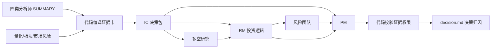

# 顶级机构投研决策归因层设计

## 1. 背景

当前 TradingAgents 已有市场、基本面、新闻、舆情、量化、板块、研究主管、风险团队和投资组合经理等角色。四份前置分析师报告也会被 RM 与 PM 读取，但最终 `decision.md` 无法回答三个关键问题：

1. 哪位分析师改变了哪项决策；
2. 最终结论具体依赖哪些事实；
3. 若删除某位分析师，其边际贡献是否真的存在。

最新真实报告还暴露出两个组织问题：长报告被多次摘要后，原始证据被稀释；不同角色可以对同一决策变量重复发言，但没有明确决策权限。结果不是“分析师没有参与”，而是“参与不可审计、影响不可度量”。

本设计将系统定位为**机构买方投研委员会**：分析师拥有研究领域，RM 负责形成投资逻辑，风险团队负责交易许可与风险预算，PM 对最终动作和仓位负责。它借鉴头部机构的专业分工、独立观点、投资委员会和持续风险监督方式，但不照搬线下团队的会议数量。

## 2. 目标与非目标

### 2.1 目标

1. 将四份分析师现有 `SUMMARY` 编译成统一、可验证的证据卡。
2. 明确各角色可影响的决策变量，防止越权结论直接进入最终决策。
3. 生成一页式 IC 决策包，作为 RM/PM 的首要研究入口。
4. 要求 RM/PM 使用证据 ID，最终 `decision.md` 展示可读的决策归因表。
5. 证据缺失、陈旧、格式错误或权限不匹配时显式降为“不完整”，禁止伪装成完整归因。
6. 不新增 LLM 调用，控制运行耗时和 Token。
7. 保持现有评级、仓位、入场门和 harness 归档兼容。

### 2.2 非目标

- 本轮不合并或删除任何现有 Agent。
- 本轮不修改估值公式、AI 主升浪规则、市场风险门控或大盘预警模型。
- 本轮不自动根据归因完整度改变评级或仓位。
- 本轮不回写历史报告；只影响新生成的报告。
- 本轮不把模型 Think 或内部推理写入报告。

## 3. 方案选择

### 方案 A：只加强 Prompt

要求 RM/PM 在正文中多引用分析师。改动小，但模型可能漏写、误引或继续用泛化表述，无法稳定验证。

### 方案 B：LLM 研究 + 代码归因（采用）

复用现有分析师 `SUMMARY`，由纯 Python 编译证据卡、检查权限、生成 IC 决策包和渲染归因。LLM 继续负责观点、冲突判断和最终解释，不负责证据 ID 的合法性。

优点是没有新增调用，能审计、能测试，并符合“推理交给 LLM，确定性逻辑交给代码”的项目原则。

### 方案 C：新增独立 IC Agent

增加一个 LLM Agent 重读所有报告并生成决策包。语义能力更强，但会增加耗时、Token 和一次新的格式稳定性风险，也会再造一层摘要，不适合 P0。

## 4. 决策权限

| 角色 | 主责决策变量 | 可以提供辅助证据 | 无权单独决定 |
|---|---|---|---|
| 基本面分析师 | 12 个月盈利趋势、估值、盈利质量、治理风险 | 长期评级、目标价 | 三日入场、仓位、止损 |
| 市场分析师 | 未来三日结构、关键价位、短期动量、技术失效位 | 入场时机 | 12 个月评级、目标价 |
| 新闻分析师 | 催化剂、事件风险、预期修正、硬数据 | 长期评级、目标价、短期事件窗口 | 仓位上限 |
| 舆情分析师 | 拥挤度、叙事强弱、情绪极值 | 入场置信度、反身性风险 | 目标价、长期盈利判断 |
| 量化/板块确定性模块 | 因子分、相对强弱 | 评级和时机交叉验证 | 最终评级和动作 |
| 市场风险系统 | 市场许可、仓位上限、风险级别 | 入场门 | 个股 12 个月基本面评级 |
| RM | 投资逻辑、12 个月评级、目标价、证伪条件 | 向 PM 提交建议 | 仓位、止损、最终交易动作 |
| 风险团队 | 风险预算、止损、情景压力、交易许可 | 建议缩放仓位 | 改写 12 个月基本面事实 |
| PM | 最终动作、仓位、入场、止损、是否采纳 RM | 全部 | 无；但必须留下归因 |

代码只校验证据卡与决策变量的权限关系。V1 对越权引用显示告警，不暗中改写模型结论。

## 5. 证据卡

证据卡是代码从现有 `SUMMARY` 确定性生成的结构化对象，不要求分析师再写一份长文本。

```yaml
claim_id: MKT-TREND-01
owner: market
decision_variable: short_term_trend
claim: 日线趋势上行，周线趋势震荡
direction: bullish
horizon: 3d
confidence: medium
as_of: 2026-08-12
source: market_report.SUMMARY
falsifier: 跌破关键支撑或价格数据过期
quality_status: valid
```

### 5.1 稳定 ID

ID 按领域和决策变量生成，不依赖文本顺序：

- `MKT-*`：市场和技术面；
- `FUND-*`：基本面和估值；
- `NEWS-*`：催化与事件；
- `SENT-*`：舆情与拥挤；
- `QUANT-*`、`SECTOR-*`、`RISK-*`：确定性辅助输入。

同一事件列表使用固定序号。生成器必须去重，不能让重复摘要制造多票错觉。

### 5.2 质量状态

每张卡只能处于：

- `valid`：字段合法且时点可用；
- `partial`：结论可读，但来源、日期或反证条件不完整；
- `stale`：超过该决策变量允许的时效；
- `invalid`：YAML 无法解析、值域错误或相互矛盾。

`invalid` 卡不能用于归因；`partial` 和 `stale` 必须在 IC 决策包和最终归因中带告警。

### 5.3 决策时效

- 三日趋势、入场、情绪：必须使用当日或最近有效交易日数据；盘中价格沿用现有 `price_data_status` 真值。
- 新闻事件：使用 `source_date` 与 `event_date`，未知日期只能标为 `partial`。
- 一年期基本面：V1 以报告生成日记录审计时点；底层财报日期缺失时标为 `partial`，不能声称来源完整。
- 市场风险快照：沿用现有 stale/required checkpoint 判断。

## 6. IC 决策包

新增纯 Python 的 `Research Evidence Officer` 节点，位于 `Consensus Officer` 之后、Bull/Bear 研究之前。它不调用网络或 LLM，输入现有 state，输出：

- `research_evidence_ledger: dict`：完整机器可读证据账本；
- `ic_packet: str`：供 RM/PM 阅读的一页式 Markdown。

IC 决策包固定顺序：

1. 数据完整度与过期告警；
2. 未来三日结构与入场证据；
3. 一年期盈利、估值与目标价证据；
4. 催化剂、事件风险和拥挤度；
5. 量化、板块和市场风险交叉验证；
6. 冲突清单；
7. 全部证据 ID 索引。

冲突由代码按同一决策变量的方向识别，例如基本面偏多而新闻预期修正偏空。代码只指出冲突，不替 LLM 决定哪一方正确。

## 7. RM 与 PM 数据流



### 7.1 RM

- IC 决策包成为首要输入。
- 四份原始报告暂时保留为“冲突下钻资料”，保证估值和硬数据不因 P0 截断。
- `RM_SUMMARY` 增加四个扁平字符串字段：`rating_evidence_ids`、`target_price_evidence_ids`、`earnings_evidence_ids`、`key_conflict_ids`。
- 每个字段使用 `|` 分隔 ID；缺失填 `null`，禁止编造 ID。

### 7.2 PM

- 默认读取 IC 决策包、RM thesis、风险记录、股票画像、量化和板块结果。
- 不再重复注入四份完整原始报告；需要的硬证据必须已进入 IC 决策包或 RM thesis。
- `PM_SUMMARY` 增加四个扁平字段：`short_term_evidence_ids`、`long_term_evidence_ids`、`position_evidence_ids`、`target_price_evidence_ids`。
- PM 仍是最终决策人，可以否决 RM，但必须引用反向证据。

## 8. 最终报告

`decision.md` 原有醒目操作摘要和 Trade Ticket 保持不变。在“现在怎么做”之后增加：

```markdown
## 为什么这样决定

| 决策项 | 最终结论 | 主责团队 | 关键证据 | 归因状态 |
|---|---|---|---|---|
| 未来三日 | 等回踩 | 市场分析 | MKT-TREND-01, RISK-GATE-01 | 完整 |
| 一年期评级 | OVERWEIGHT | 基本面/RM | FUND-GROWTH-01, NEWS-CAT-01 | 完整 |
| 新建仓位 | 0% | 风险/PM | RISK-GATE-01 | 完整 |
| 目标价 | 120-135 元 | 基本面/RM | FUND-VAL-01 | 部分：财报日期缺失 |
```

该表由代码读取 `PM_SUMMARY` 和证据账本渲染，模型不能直接写最终表格。若引用不存在、已失效或权限不匹配，状态显示为“缺失/过期/权限不匹配”，不得替模型猜测正确证据。

`PM_SUMMARY` 仍是报告最后一个 YAML 块，现有 harness 可继续解析。新增字段不改变旧字段语义。

## 9. 兼容与失败处理

1. 某份 `SUMMARY` 解析失败：保留原分析流程，IC 决策包标记该领域缺失；不得中断整支股票分析。
2. 证据卡不完整：RM/PM 仍可工作，但最终报告必须显示归因不完整。
3. PM 输出遗漏新增 ID 字段：报告展示“未完成证据归因”，不删除 Trade Ticket，不改变仓位。
4. 旧 checkpoint 恢复时没有新 state 字段：使用空账本兼容。
5. 证据编译和渲染发生异常：记录 warning 并降级到现有报告流程。

## 10. 测试与验收

### 10.1 单元测试

1. 四种 `SUMMARY` 均能生成稳定 ID、正确方向和决策变量。
2. 无效 YAML、空字段、未知日期和过期价格正确降级。
3. 重复事件不产生重复证据卡。
4. 同一决策变量多空相反时生成冲突，不替代 LLM 判断。
5. 权限校验拒绝用舆情卡单独支撑目标价、用基本面卡单独支撑三日入场。
6. PM 引用不存在或过期的 ID 时，归因表显示明确状态。
7. `PM_SUMMARY` 仍可被 harness 解析，新增字段不破坏旧字段。

### 10.2 集成测试

1. 图顺序为 `Consensus -> Research Evidence -> Bull Researcher`。
2. RM prompt 包含 IC 决策包和证据引用规则。
3. PM prompt 不再注入四份完整分析师报告。
4. 新 state 字段被初始化、记录并保存为 `1_analysts/ic_packet.md`。
5. 最终 `decision.md` 在第一屏展示四项决策归因，且不出现模型工作过程。

### 10.3 股票冒烟

使用项目 `.venv` 运行一支近期常查 A 股。验收要求：

- 分析完整跑通且产生 `decision.md`；
- 当前价时点正确；
- 四项决策至少三项引用有效证据 ID；
- 短期操作、一年期评级、仓位与原 Trade Ticket/`PM_SUMMARY` 一致；
- 无新增 LLM 调用，运行时间不因决策归因层显著增加；
- 报告首屏可读，证据缺口显式可见。

## 11. 后续阶段

P0 上线并积累样本后，再做两项独立优化：

1. harness 消融评估：屏蔽单个分析师证据，测量评级、入场、仓位和置信度变化；
2. 根据边际贡献决定是否合并新闻与舆情、简化风险辩论。

没有消融证据前，不以单份报告结果倒推删除 Agent。
